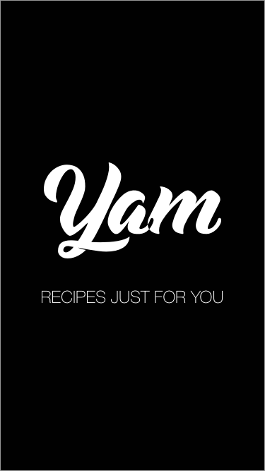
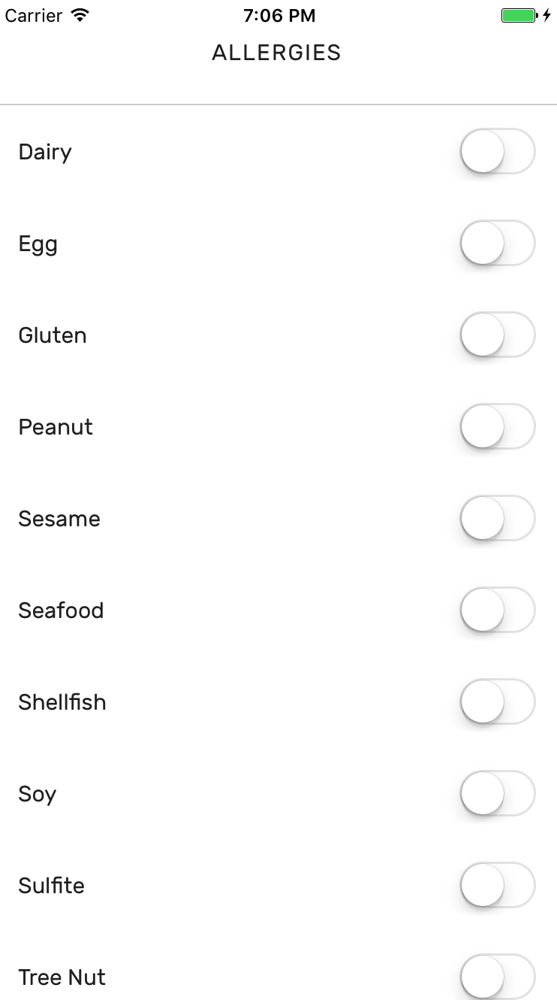
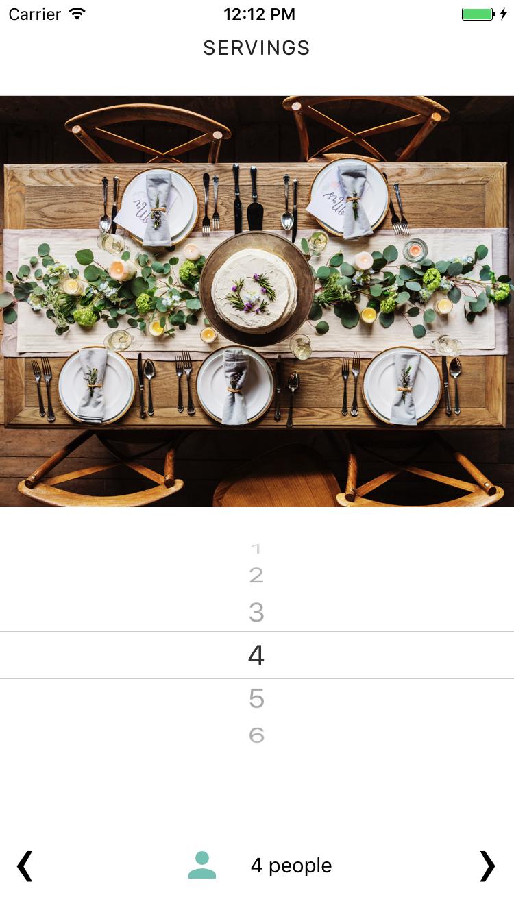
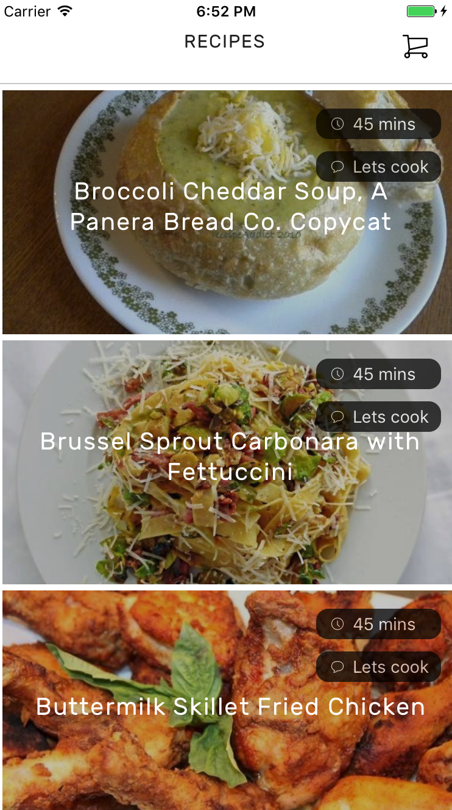
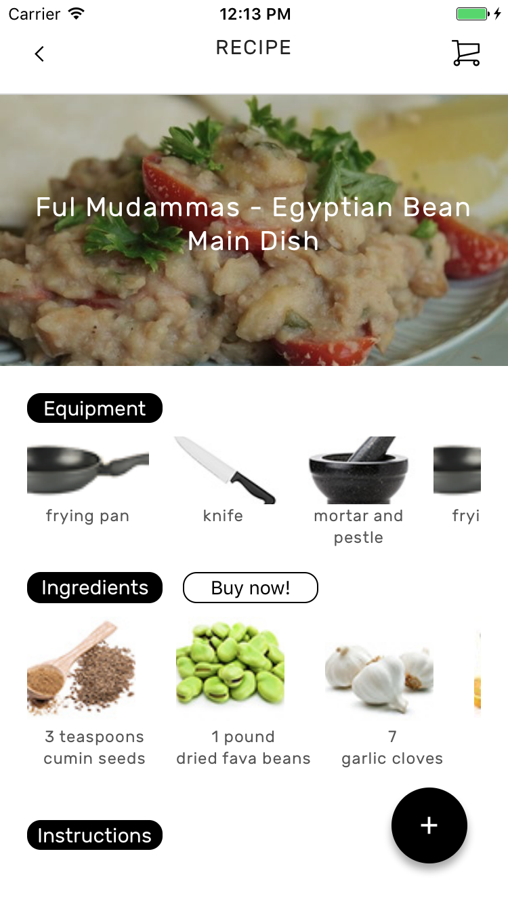
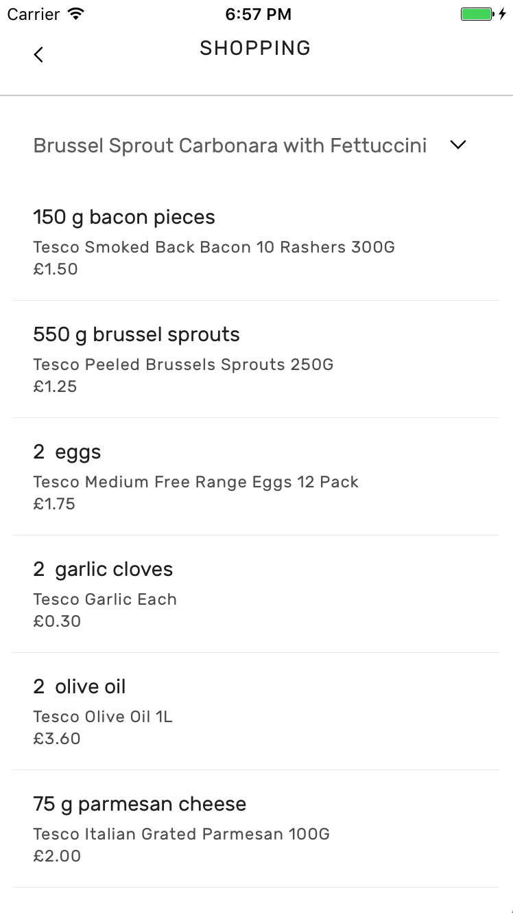

# YAM RECIPE APP

## Description
A meal planning mobile app for iOS that takes in to account your dislikes, allergies and dietary requirements and recommends recipes based on these values.  The app also creates a shopping list based on Tesco product data.

## Installation

* Clone this Repo
* Run `npm install`
* Run `react-native run-ios`

Note: You will need to have React Native and XCode already set up for this to work

  

 

## Tech Stack

**Main Framework**
* [React Native](https://github.com/facebook/react-native)
* [Redux](https://github.com/reactjs/redux)

**APIs**
* Spoonacular
* Tesco
* Ulabox

**Libraries**:
* [Shoutem UI](https://github.com/shoutem/ui)
* [Vector Icons](https://github.com/oblador/react-native-vector-icons)
* [React Native Router Flux](https://github.com/oblador/react-native-vector-icons)
* [Swiper](https://github.com/leecade/react-native-swiper)
